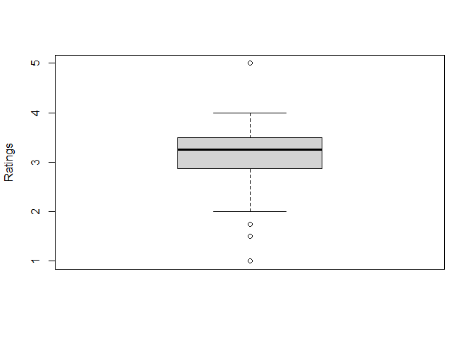
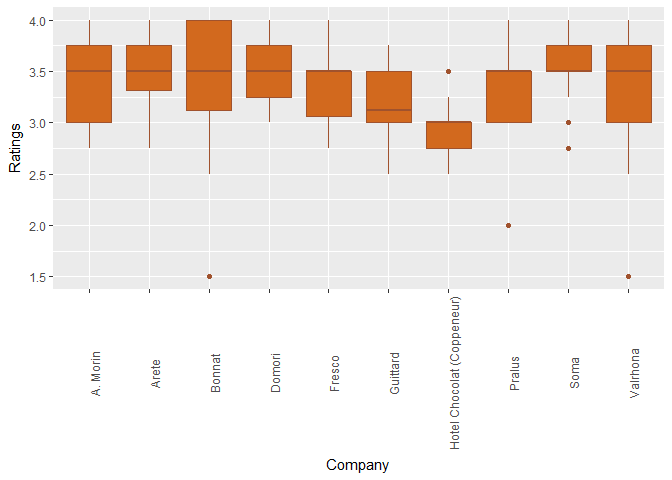
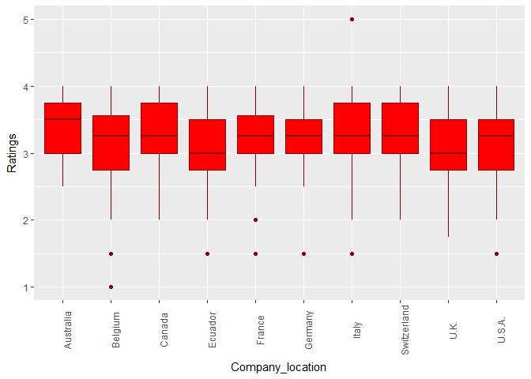
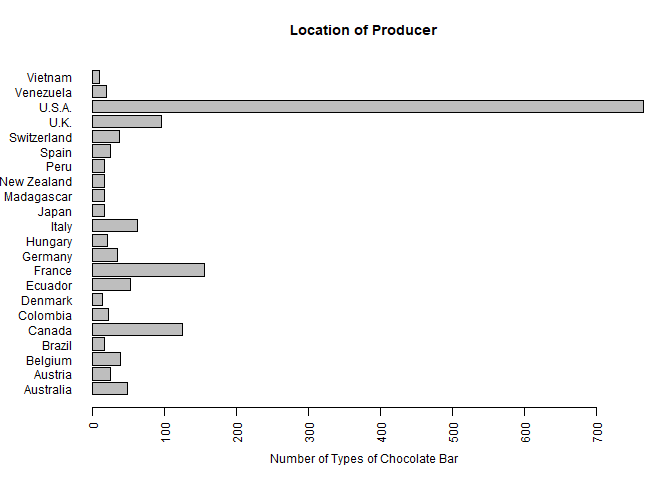
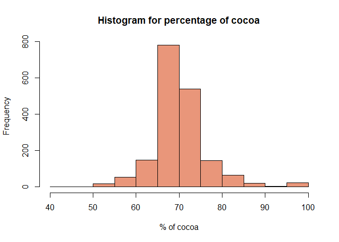
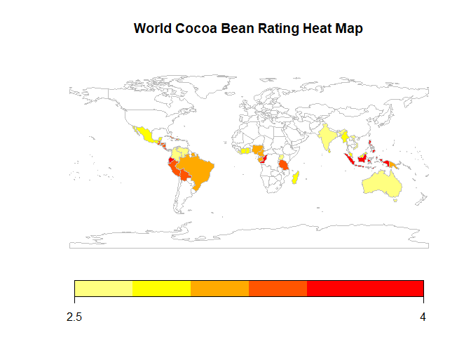
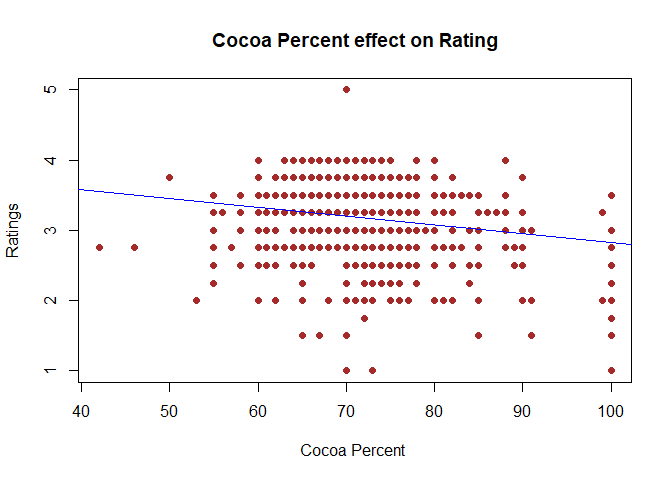

Midterm Project: Bean-to-Bar Chocolate Analysis
================
Kate Jones, Akshay Kamath, Purvi Thakor
October 10, 2017

### Background of our dataset

Chocolate is produced by companies around the world, leading to almost 2000 different types of chocolate bars. These bars have been rated by experts on a scale from 1 to 5. There are many potential influences on this rating, including the origin of the chocolate, the percentage of cocoa it contains, and the origin of the beans used in production.

We obtained a dataset which included the ratings of 1795 chocolate bars. We had data on 9 variables for each bar, as seen by finding the dimensions of the dataset:

Link to dataset : <https://www.kaggle.com/rtatman/chocolate-bar-ratings>

    ## 'data.frame':    1795 obs. of  9 variables:
    ##  $ CompanyÂ...Maker.if.known.      : Factor w/ 416 levels "A. Morin","Acalli",..: 1 1 1 1 1 1 1 1 1 1 ...
    ##  $ Specific.Bean.Origin.or.Bar.Name: Factor w/ 1039 levels "\"heirloom\", Arriba Nacional",..: 15 494 68 16 813 175 288 923 805 731 ...
    ##  $ REF                             : int  1876 1676 1676 1680 1704 1315 1315 1315 1319 1319 ...
    ##  $ Review.Date                     : int  2016 2015 2015 2015 2015 2014 2014 2014 2014 2014 ...
    ##  $ Cocoa.Percent                   : num  0.63 0.7 0.7 0.7 0.7 0.7 0.7 0.7 0.7 0.7 ...
    ##  $ Company.Location                : Factor w/ 60 levels "Amsterdam","Argentina",..: 19 19 19 19 19 19 19 19 19 19 ...
    ##  $ Rating                          : num  3.75 2.75 3 3.5 3.5 2.75 3.5 3.5 3.75 4 ...
    ##  $ Bean.Type                       : Factor w/ 42 levels ""," ","Amazon",..: 2 2 2 2 2 10 2 10 10 2 ...
    ##  $ Broad.Bean.Origin               : Factor w/ 101 levels ""," ","Africa, Carribean, C. Am.",..: 70 80 80 80 57 93 18 93 93 57 ...

``` r
dim(chocolate)
```

    ## [1] 1795    9

These 9 variables included rating, company, country of company, country of bean production, and others, when examining the structure of the dataset:

``` r
str(chocolate)
```

    ## 'data.frame':    1795 obs. of  9 variables:
    ##  $ Company                        : Factor w/ 416 levels "A. Morin","Acalli",..: 1 1 1 1 1 1 1 1 1 1 ...
    ##  $ Specific_bean_origin_or_barname: Factor w/ 1039 levels "\"heirloom\", Arriba Nacional",..: 15 494 68 16 813 175 288 923 805 731 ...
    ##  $ REF                            : int  1876 1676 1676 1680 1704 1315 1315 1315 1319 1319 ...
    ##  $ Review_date                    : int  2016 2015 2015 2015 2015 2014 2014 2014 2014 2014 ...
    ##  $ Cocoa_percent                  : num  0.63 0.7 0.7 0.7 0.7 0.7 0.7 0.7 0.7 0.7 ...
    ##  $ Company_location               : Factor w/ 60 levels "Amsterdam","Argentina",..: 19 19 19 19 19 19 19 19 19 19 ...
    ##  $ Rating                         : num  3.75 2.75 3 3.5 3.5 2.75 3.5 3.5 3.75 4 ...
    ##  $ Bean_type                      : Factor w/ 42 levels ""," ","Amazon",..: 2 2 2 2 2 10 2 10 10 2 ...
    ##  $ Broad_bean_origin              : Factor w/ 101 levels ""," ","Africa, Carribean, C. Am.",..: 70 80 80 80 57 93 18 93 93 57 ...

With these factors in mind, we sought out to determine the relationship between these factors in the quality of chocolate. Our research question focuses on the relationship between rating of chocolate and country of origin, and we also examined if cocoa percentage and origin of beans played a role.

### Summary and descriptive statistics

We first found the summary statistics for the dataset overall:

``` r
summary(chocolate)
```

    ##      Company       Specific_bean_origin_or_barname      REF      
    ##  Soma    :  47   Madagascar        :  57           Min.   :   5  
    ##  Bonnat  :  27   Peru              :  45           1st Qu.: 576  
    ##  Fresco  :  26   Ecuador           :  42           Median :1069  
    ##  Pralus  :  25   Dominican Republic:  37           Mean   :1036  
    ##  A. Morin:  23   Venezuela         :  21           3rd Qu.:1502  
    ##  Arete   :  22   Chuao             :  19           Max.   :1952  
    ##  (Other) :1625   (Other)           :1574                         
    ##   Review_date   Cocoa_percent   Company_location     Rating     
    ##  Min.   :2006   Min.   :0.420   U.S.A. :764      Min.   :1.000  
    ##  1st Qu.:2010   1st Qu.:0.700   France :156      1st Qu.:2.875  
    ##  Median :2013   Median :0.700   Canada :125      Median :3.250  
    ##  Mean   :2012   Mean   :0.717   U.K.   : 96      Mean   :3.186  
    ##  3rd Qu.:2015   3rd Qu.:0.750   Italy  : 63      3rd Qu.:3.500  
    ##  Max.   :2017   Max.   :1.000   Ecuador: 54      Max.   :5.000  
    ##                                 (Other):537                     
    ##                 Bean_type            Broad_bean_origin
    ##                     :887   Venezuela         :214    
    ##  Trinitario          :419   Ecuador           :193    
    ##  Criollo             :153   Peru              :165    
    ##  Forastero           : 87   Madagascar        :145    
    ##  Forastero (Nacional): 52   Dominican Republic:141    
    ##  Blend               : 41                    : 73    
    ##  (Other)             :156   (Other)           :864

Since we are interested in honing in on how ratings are affected, it is worth examining the distribution of ratings.

``` r
ratings<-chocolate$Rating
summary(ratings)
```

    ##    Min. 1st Qu.  Median    Mean 3rd Qu.    Max. 
    ##   1.000   2.875   3.250   3.186   3.500   5.000

``` r
boxplot(chocolate$Rating, ylab = "Ratings", col="light gray")
```



This boxplot shows how the average rating is just over 3 (3.186), and that most chocolate bars fall within the InterQuartile Range of 2.875 to 3.5. It is important to note that we seem to have avoided a common problem with ratings-- where the scale grows so inflated that it's hard to distinguish truly remarkable instances. Instead, it appears that ratings above 3.5 are actually quite good, and not overwhelmingly common.

    ## Warning: package 'sqldf' was built under R version 3.4.2

    ## Loading required package: gsubfn

    ## Warning: package 'gsubfn' was built under R version 3.4.2

    ## Loading required package: proto

    ## Warning: package 'proto' was built under R version 3.4.2

    ## Loading required package: RSQLite

    ## Warning: package 'ggplot2' was built under R version 3.4.2

To see how the ratings were distributed across companies which produced the chocolates, we took a list of companies with most number of chocolates rated and plotted a box plot of ratings against the companies.

``` r
company_rating_boxplot
```



All ten chocolate companies have more or less the same median rating, surprisingly! However, Bonnat, the French chocolatier company, has 27 chocolates rated & 8 of their chocolates have received a 4 rating.

We also wanted to see how the ratings were distributed across Countries from where the chocolates were produced. We took a list of countries with most number of chocolates rated in this survey and plotted a box plot of ratings against the countries.

``` r
company_location_rating_boxplot
```



Australia has the highest median rating according to this box plot with an average rating of 3.36

### Graphical representations of our data

Since we want to determine the relationship between location of production and quality, it is worth considering which countries are major producers. We created a bar chart for country of origin:

``` r
count<-summary(chocolate$Company_location)
location_count<-count[which(count>10)]
par(las=2, cex=.75, mar=c(5, 6, 4, 2)+.01 )
barplot(location_count, horiz=TRUE, main="Location of Producer", xlab="Number of Types of Chocolate Bar")
```



Since we were interested in how cocoa percentage may also affect the score a chocolate bar receives, we examined the distribution of these percentages.

``` r
#Producing a histogram for cocoa percentage
Cocoa_Percentage<-100*chocolate$Cocoa_percent
hist(Cocoa_Percentage, main = "Histogram for percentage of cocoa", xlab = "% of cocoa", col= "darksalmon", border = "black")
```



The distribution appears relatively symmetric, with most chocolate bars containing about 70% cocoa. Since the distribution is so concentrated arounda few values, it will be interesting to see whether this factor actually affects the quality to a significant degree.

Next, we wanted to see if there was any relationship between where beans were sourced from, and the rating received. We created a world map that shows this relationship:

``` r
#World Heat Map- install package if it isn't already downloaded

#install.packages("rworldmap")
library(rworldmap)

Bean_Origin <- joinCountryData2Map(chocolate, joinCode="NAME", nameJoinColumn="Broad_bean_origin")
```

    ## 1555 codes from your data successfully matched countries in the map
    ## 240 codes from your data failed to match with a country code in the map
    ## 196 codes from the map weren't represented in your data

``` r
mapCountryData(Bean_Origin, nameColumnToPlot="Rating", mapTitle="World Cocoa Bean Rating Heat Map")
```



This heat map shows the different origins for cocoa beans, and how beans rated, on average, based on their origin. We can see that certain regions do tend to score more highly.

Having examined these relationships, we moved into analyzing whether relationships were significant.

### Correlation analysis

``` r
cor(Cocoa_Percentage, ratings)
```

    ## [1] -0.1650354

``` r
s="brown"
plot(Cocoa_Percentage, chocolate$Rating, main="Cocoa Percent effect on Rating", 
     xlab="Cocoa Percent ", ylab="Ratings", pch=19, col = s)

abline(lm(chocolate$Rating~Cocoa_Percentage), col="blue")
```



These results indicate a weak relationship between location of production and quality of chocolate, as measured by the expert rating they received.

### Initial one way ANOVA

We still wanted to determine whether the relationship between rating and location was statistically significant. A one-way ANOVA table can be useful in deciding whether the relationship is significant. Below, a table is produced with Chocolate Rating as the dependent variable, and Location as the factor variable.

``` r
y<-chocolate$Rating
A<- chocolate$Company_location

fit <- aov(y ~ A, data=chocolate)
summary(fit)
```

    ##               Df Sum Sq Mean Sq F value   Pr(>F)    
    ## A             59   23.8  0.4025   1.808 0.000204 ***
    ## Residuals   1735  386.3  0.2226                     
    ## ---
    ## Signif. codes:  0 '***' 0.001 '**' 0.01 '*' 0.05 '.' 0.1 ' ' 1

The p-value is statistically significant, as it is well below an alpha-level of .05. This implies that there is a significant relationship between the Location factor and how well a chocolate bar rates.

However, it is worth considering how other factors may contribute to rating as well. To see if Cocoa Percentage could also contribute, we conducted a two-way ANOVA with a second factor of Cocoa Percentage.

### Two way ANOVA

``` r
B<- chocolate$Cocoa_percent

fit<-aov(y~A + B + A:B, data=chocolate)
summary(fit)
```

    ##               Df Sum Sq Mean Sq F value   Pr(>F)    
    ## A             59   23.8   0.403   1.918 4.51e-05 ***
    ## B              1   11.0  11.009  52.453 6.67e-13 ***
    ## A:B           45   20.8   0.461   2.197 1.02e-05 ***
    ## Residuals   1689  354.5   0.210                     
    ## ---
    ## Signif. codes:  0 '***' 0.001 '**' 0.01 '*' 0.05 '.' 0.1 ' ' 1

These results also indicated statistical significance of location, even after controlling for another factor (cocoa percentage) and their interaction.

It is interesting to note that the impact of Cocoa Percent on Rating appears to be statistically significant, yet a quick check of correlation finds almost no relationship between Percent and Rating.
